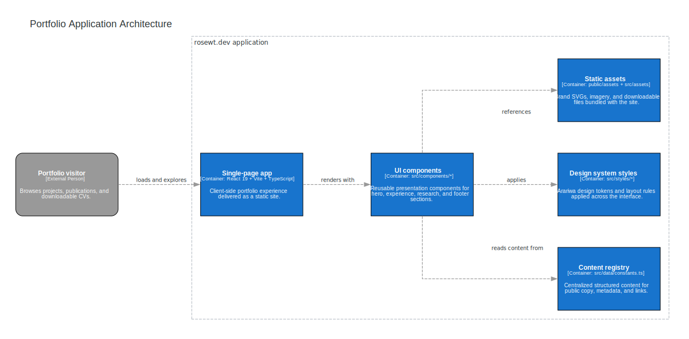
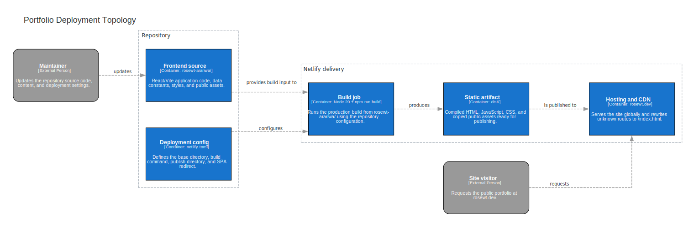

# Diagrams (Mingrammer)

This directory contains the Mingrammer source files and generated SVG artifacts for the portfolio documentation. The diagrams reflect the current React/Vite application in `rosewt-arariwa/` and the Netlify deployment path defined in `netlify.toml`.

## Included Diagrams

### Application Architecture



This view focuses on the runtime structure of the portfolio application: reusable React components render the SPA, consume structured content from `src/data/constants.ts`, apply the Arariwa CSS system, and reference static assets served with the site.

### Deployment Topology



This view shows the delivery path used in production: repository source and `netlify.toml` feed the Netlify build job, which produces the `dist/` bundle and publishes the site at `rosewt.dev`.

## Source Files

- `common.py`
- `architecture.py`
- `deployment.py`

## Requirements

- `uv`
- Graphviz (`dot`)

## Generate

```bash
cd docs/diagrams
uv sync
uv run python architecture.py
uv run python deployment.py
```

## Generated Artifacts

- `architecture.svg`
- `deployment.svg`
